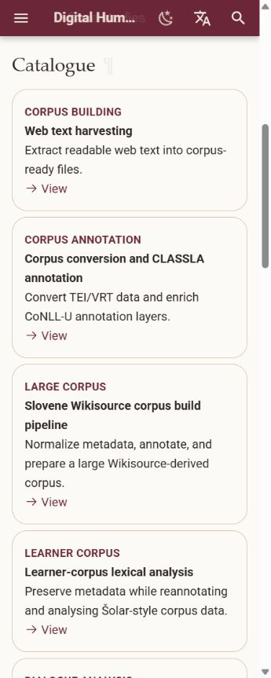
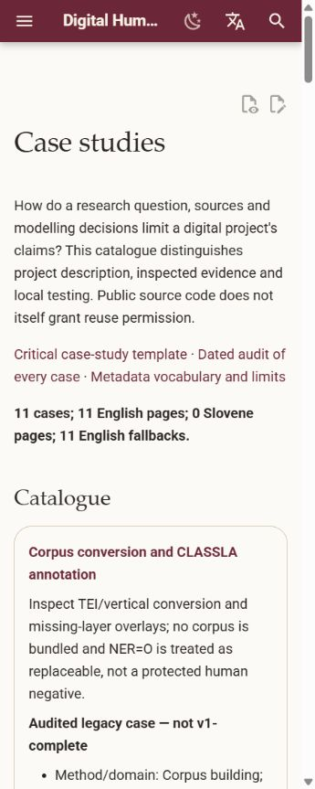
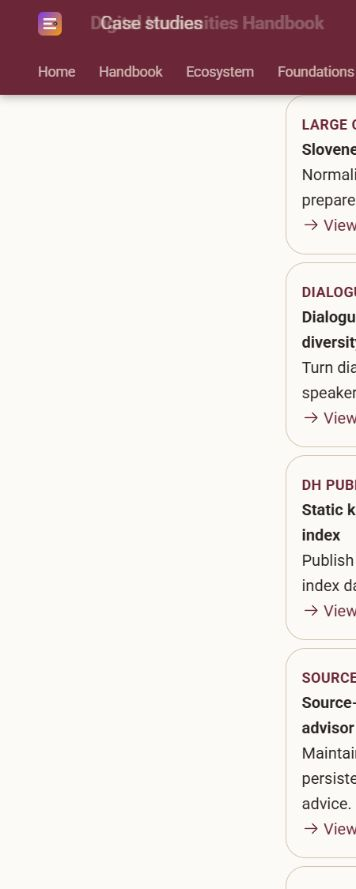
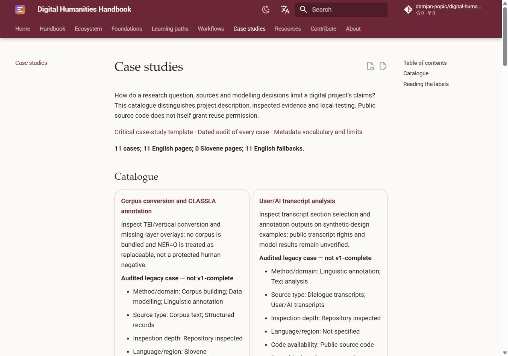
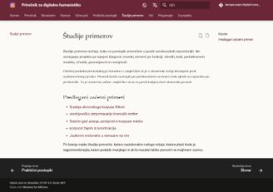
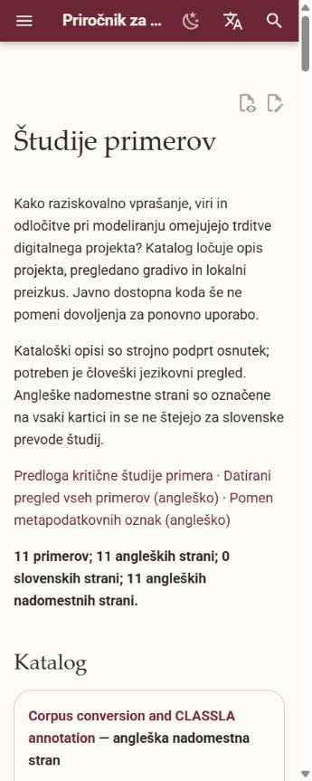
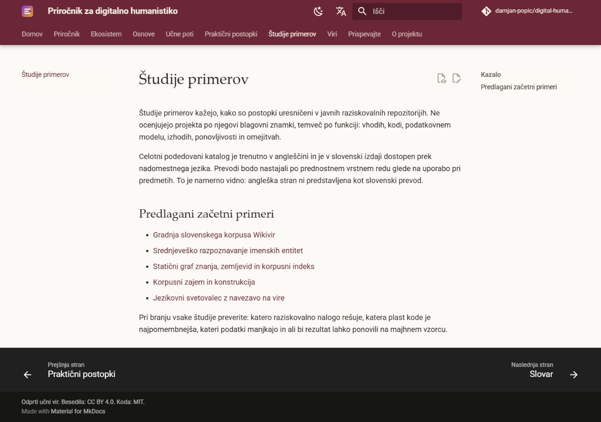
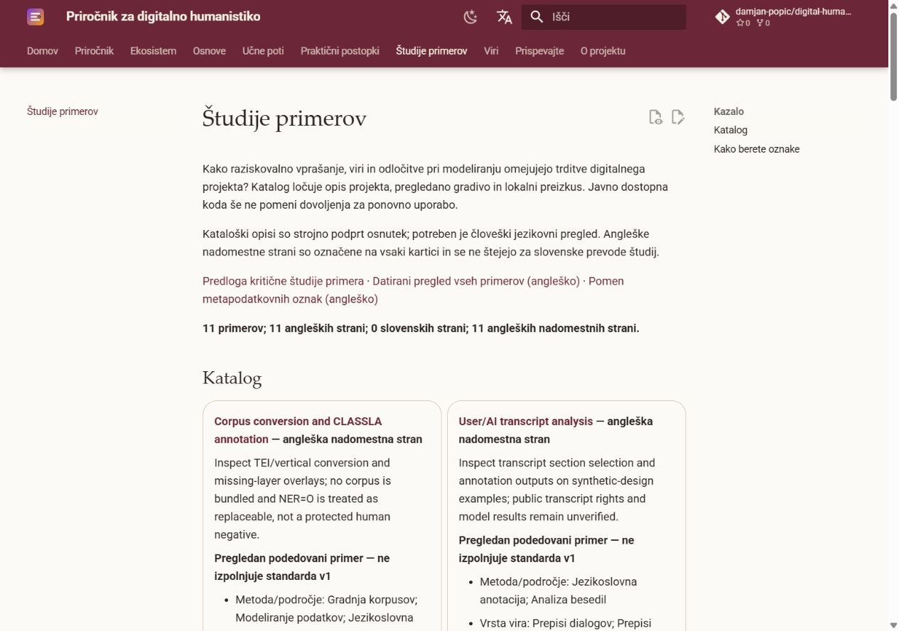
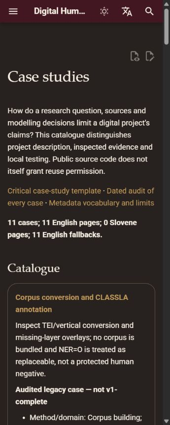
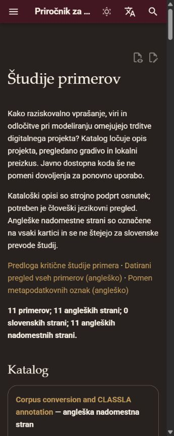

# Case-study framework display checks

Captured on 2026-09-09 from the local strict MkDocs build. The before images use
main at `a728334d2fa2d1f217ffbce20d8a1e5354692806`; after images show the phase 1
issue #27 catalogue. These are original screenshots of this handbook, not
third-party project interfaces. The repository's text/image licence applies.

Both catalogues were checked at 360, 768 and 1280 CSS pixels wide (900 pixels
high), in light and dark mode. All twelve combinations showed eleven cards,
correctly paired language links and no horizontal page overflow. Edit/source
actions remain separate from the content. Cards use the existing theme; no
CSS, client-side filtering application or navigation redesign was added.
The Slovene catalogue visibly identifies its eleven English fallback links;
it does not claim that the case pages have been translated.

## Before and after: English

| Width | Before | After |
| --- | --- | --- |
| 360 px, light |  |  |
| 1280 px, light |  |  |

## Before and after: Slovene

| Width | Before | After |
| --- | --- | --- |
| 360 px, light |  |  |
| 1280 px, light |  |  |

## Dark-mode mobile samples

Display checks do not constitute a complete assistive-technology audit or
human Slovene-language approval. The visible machine-assisted draft notice
and the remaining translation gap are intentional.
